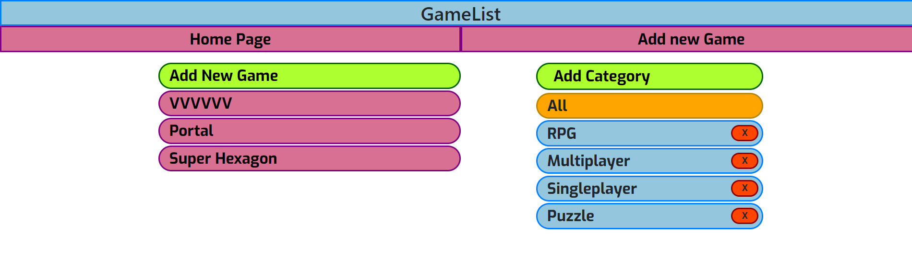
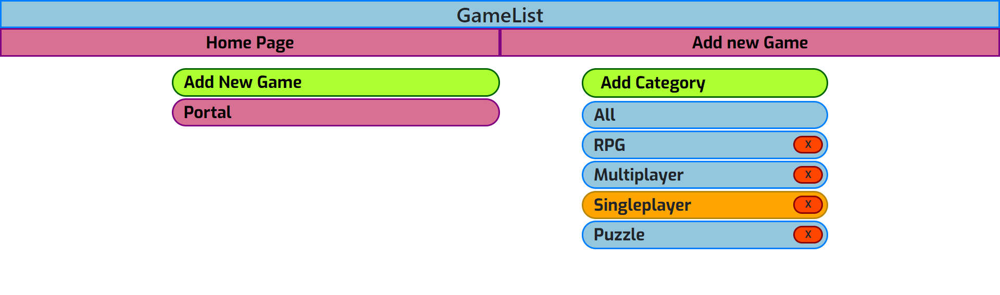
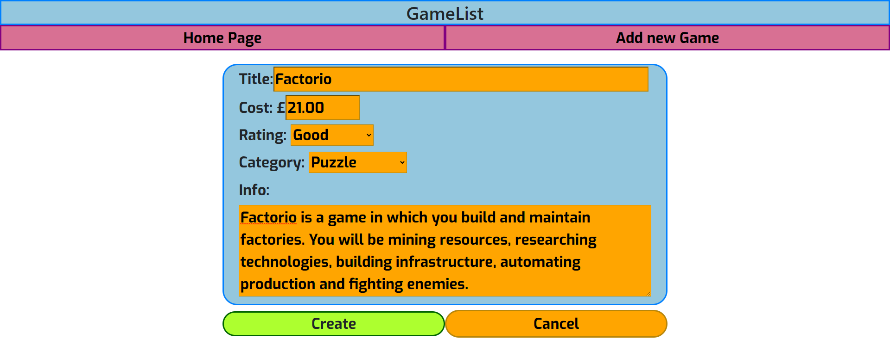
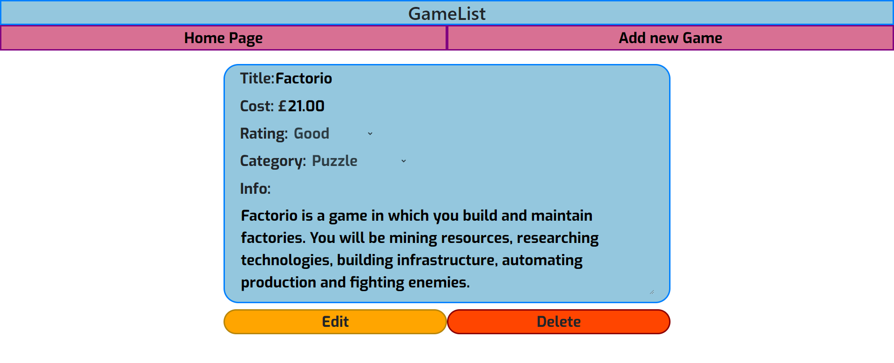

# GameList

## Index – Table of Contents
* [Designs](#designs)
* [Technologies Used](#technologies-used)
* [Testing](#testing)

## Designs

## Technologies used
* HTML5
* CSS3
* [HTML Validator](https://validator.w3.org) for validity of HTML
* [CSS Validator](https://jigsaw.w3.org/css-validator) for validity of CSS
* [Bootstrap4](https://getbootstrap.com) for the grid layout, components and styling
* [Git](https://git-scm.com) for version control
* [GitHub](https://github.com) for the repository to store the files
* [GitPod](https://gitpod.io) to test and edit the website
* [Heroku](https://dashboard.heroku.com) to deploy the site

## Testing
| Test Label | Test Action | Expected Outcome | Test Outcome |
| --- | --- | --- | --- |
| HTML Validator | Check for any warnings or errors at [HTML Validator](https://validator.w3.org/) | No warnings or errors reported | PASS |
| CSS Validator | Check for any warnings or errors at [CSS Validator](https://jigsaw.w3.org/css-validator/) | No warnings or errors reported | PASS |
| Opening home browser | Opening the home website browser by google chrone, microsoft edge and phones | Home website can be opened | PASS |
| Screen Size | Resizing all website screens for any sizes above 300 pixels | All websites is responsive when screen changes size to fit | PASS |
| Open new page | Clicking new game button | Opens new page | PASS |
| Enter new information | Entering infromations on new page | Infromations can be inserted | PASS |
| Cancel new game | Clicking cancel button in new page | New game not created and returns to home page | PASS |
| Create new game | Clicking create button in new page | New game created and opens to created game page | PASS |
| Start edit | Clicking edit in info page | Game infromation now editable | PASS |
| Cancel edit | Clicking cancel in info page | Game infomation now not editable and changes not saved | PASS |
| Save edit | Clicking save in info page | Game infomation now not editable and changes saved | PASS |
| Delete game | Clicking delete in info page | Alert page to confirm delete shows | PASS |
| Cancel delete game | Clicking cancel in delete confirmation | Alert page gone and no changes made | PASS |
| Confirm delete game | Clicking ok in delete confirmation | Game deleted and returned to home page | PASS |
| Select game | Clicking game in home page | Opens info page on selected game | PASS |
| Select home | Clicking home in info page | Opens to home page | PASS |
| Enter category | Clicking new category button | Text button can now be entered | PASS |
| Cancel category | Exiting new category text with nothing entered | New category text returned with no category made | PASS |
| Create category | Exiting new category text with something entered | New category made | PASS |
| Select category | Clicking category button | Game list filtered to only display with selected category | PASS |
| Delete category | Clicking category X button | Alert page to confirm delete shows | PASS |
| Cancel category game | Clicking cancel in delete confirmation | Alert page gone and no changes made | PASS |
| Confirm category game | Clicking ok in delete confirmation | Category deleted | PASS |